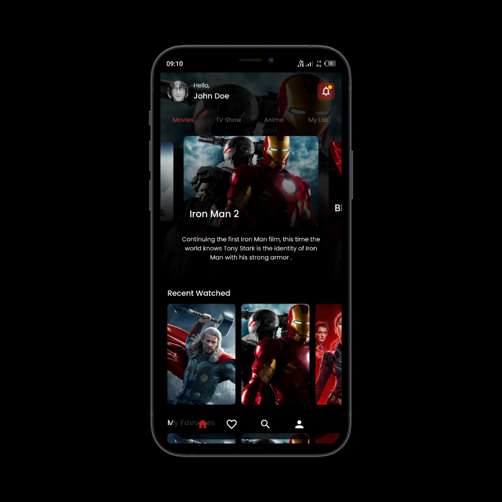

# Streaming Movie Mobile

My simple project with Flutter
<!-- TODO: replace by a video intro -->



## How to install

**Step 1:**

Clone this repo:

```
git@github.com:labiebhn/streaming-movies-mobile.git
```

**Step 2:**

Go to project root and execute the following command in console to get the required dependencies: 

```
flutter pub get 
```

**Step 3:**

Next, start an app to connect to. This can be either a Flutter application or a Dart command-line application. The command below specifies a Flutter app:

```
flutter run
```